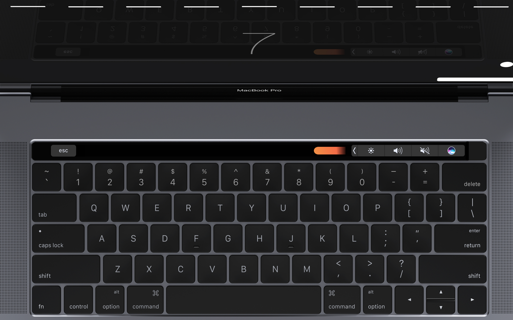
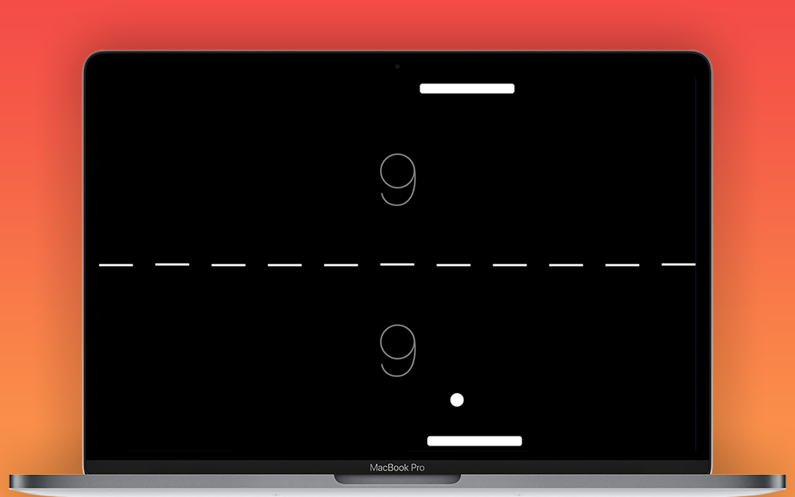

# TouchBarPong

Pong - one of the first games ever created, brought to you using the newest apple hardware.

FEATURES:
* Brand new Touch Bar support to control your Pong paddle
* A computer opponent which improve as you play
* wo difficulty modes to test your skill: Easy & Difficult
* Simple, modern and high-quality graphics

#Donation
If you like this project and you had fun with it, you can give us a cup of coffee :)

Concept and Icon Design by Ben Chamberlain www.bgchamberlain.com
https://www.behance.net/gallery/46750879/Touch-Bar-Pong

